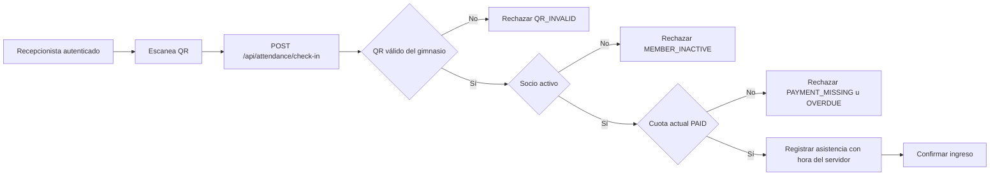

# Tarea: integridad histórica, permisos y pruebas de casos de uso

## Objetivo

Preparar e implementar una versión del backend que conserve la trazabilidad de socios, pagos y usuarios, aplique permisos por rol y cubra con pruebas automatizadas todos los casos de uso definidos para ForgeFit. El flujo prioritario es el check-in por QR: solo registra una asistencia cuando el socio está habilitado y su cuota vigente está pagada.

Esta tarea no crea una segunda regla de negocio: consolida las especificaciones existentes y fija el orden de implementación y validación.

## Problemas actuales que resuelve

| Área | Situación actual | Resultado esperado |
| --- | --- | --- |
| Socios | `DELETE /api/members/:id` elimina físicamente el documento. | La baja pasa a ser lógica mediante `membershipStatus: INACTIVE`; se conserva la relación con pagos y asistencias. |
| Pagos | `DELETE /api/payments/:id` elimina el registro y `PUT` lo puede sobrescribir. | Un pago se anula con trazabilidad; las correcciones mantienen vínculo con el pago original. |
| Usuarios | No hay administración ni estado de cuenta para usuarios. | Cada usuario tiene `accountStatus`; la baja/desactivación es lógica y evita futuros accesos. |
| Permisos | Un JWT válido accede a todas las rutas protegidas. | Cada operación verifica permisos y rol. |
| Pruebas | El proyecto no tiene archivos de prueba. | Cada caso de uso tiene pruebas de éxito, rechazo, autorización y aislamiento por gimnasio. |

## Alcance funcional

### Baja lógica de socio

- Incorporar `PATCH /api/members/:id/status` con `ACTIVE` o `INACTIVE`.
- Cambiar `DELETE /api/members/:id` para que aplique la misma baja lógica y preserve su respuesta 204.
- Conservar pagos y asistencias del socio; no reasignarlos ni eliminarlos.
- Un socio `INACTIVE` no puede realizar check-in, aunque tenga cuota pagada.
- La reactivación no implica habilitación: vuelve a evaluarse su cuota vigente.

### Anulación y corrección de pagos

- Reemplazar el borrado físico por `recordStatus: ACTIVE | VOID`, `voidedAt`, `voidedByUserId` y `voidReason`.
- No incluir pagos anulados al determinar habilitación ni al sumar importes de reportes.
- Corregir un pago cobrado anulando el original y creando un reemplazo enlazado mediante `replacesPaymentId`.
- Validar en `PUT /api/payments/:id` que el socio destino pertenezca al gimnasio del pago.

### Baja lógica de usuarios

- Agregar `accountStatus: ACTIVE | INACTIVE` al modelo User.
- Administrar usuarios con las rutas SDD-06 a SDD-09.
- Un usuario inactivo no puede iniciar sesión ni usar un token emitido antes de su desactivación.
- Impedir desactivar o quitar el rol al último `OWNER` activo de un gimnasio.
- No exponer nunca `passwordHash` en respuestas, reportes ni logs.

### Check-in QR prioritario

- El QR es opaco: no contiene DNI, email ni JWT.
- El request de check-in solo recibe `qrPayload` y `requestId`.
- El servidor obtiene socio y gimnasio desde QR/JWT, decide habilitación y asigna fecha/hora.
- Un rechazo devuelve motivo y no crea una asistencia.
- Reintentos con el mismo `requestId` no crean dos asistencias.

## Orden de trabajo

Estado de la primera etapa: **completada**. Se agregó la infraestructura descrita en [SDD-00](../specs/00-base-pruebas-integracion.md), con 26 pruebas de integración HTTP/MongoDB y las 7 unitarias existentes. Esta verificación no completa las demás etapas ni toda la matriz funcional.

1. Crear infraestructura de pruebas y datos de fábrica para gimnasio, OWNER, ADMIN, RECEPTIONIST, socio, pago y JWT.
2. Implementar estado de usuario, roles y middleware de permisos.
3. Implementar baja lógica de socios y anulación/corrección de pagos.
4. Implementar consulta de habilitación como servicio reutilizable.
5. Implementar emisión/consulta de QR.
6. Implementar check-in QR e idempotencia.
7. Implementar reportes y completar la matriz de pruebas.

No fusionar el check-in sin los pasos 2 a 5: necesita permisos, estado de socio, cuota vigente y credencial QR para ser correcto.

## Matriz de pruebas por caso de uso

| Caso de uso | Pruebas mínimas de éxito | Pruebas de rechazo e integridad |
| --- | --- | --- |
| Registrar socio | OWNER/ADMIN/recepción crea socio válido en su gimnasio. | DNI repetido dentro del gimnasio, body inválido, rol sin permiso y socio de otro gimnasio. |
| Modificar socio | Cambia datos permitidos sin perder historial. | Id inválido, id de otro gimnasio, campo inválido y rol sin permiso. |
| Dar de baja/reactivar socio | Cambia estado, conserva pagos/asistencias y es idempotente. | Socio inexistente, otro gimnasio y check-in de socio inactivo. |
| Consultar socio/estado | Devuelve datos del gimnasio y estado de habilitación. | Falta de cuota, cuota vencida, duplicada o anulada; no se escriben datos en GET. |
| Registrar/consultar pago | Crea cuota válida y aparece en historial del socio. | Socio de otro gimnasio, período inválido, importe inválido, pago duplicado y rol sin permiso. |
| Anular/corregir pago | Conserva original, guarda actor/motivo y crea reemplazo relacionado. | No borrar físicamente; pago anulado no habilita ni suma reportes. |
| Emitir/consultar QR | QR opaco se emite, se consulta y rota correctamente. | No aparece en listado de socios, otro gimnasio no accede, QR anterior queda inválido. |
| Check-in QR | Socio ACTIVE con cuota actual PAID crea una sola asistencia ALLOWED con hora del servidor. | QR inválido, socio inactivo, cuota faltante/pendiente/vencida, body manipulado, fallo persistencia y reintento con requestId. |
| Consultar asistencias | Lista general y por socio con datos del gimnasio. | Lista vacía, socio inexistente, otro gimnasio y rol sin permiso. |
| Gestionar usuarios | OWNER crea, consulta, lista, edita rol y desactiva usuario. | Email duplicado, rol inválido, no desactivar último OWNER, no exponer hash. |
| Autenticar usuario | Usuario activo inicia sesión y recibe JWT. | Credenciales inválidas, usuario inactivo y token obsoleto tras cambio de estado/rol. |
| Roles y permisos | Cada rol puede ejecutar únicamente las operaciones autorizadas. | 403 en cada permiso denegado, 401 sin token y acceso cruzado entre gimnasios. |
| Reportes | Consolida socios, pagos y asistencias en el rango pedido. | Vacío, rango inválido, pago anulado excluido, zona Argentina y rol sin permiso. |

Cada fila debe incluir pruebas HTTP de integración y, para la regla de habilitación, pruebas unitarias del servicio. Los escenarios de otro gimnasio deben ejecutarse en todos los recursos con id externo: son esenciales para verificar la separación por `gymId`.

## Criterios de aceptación

- Ningún endpoint elimina físicamente socios, pagos ni usuarios de la operación normal.
- Los cambios de estado conservan historial y actor/fecha cuando corresponda.
- Un JWT válido sin permiso recibe 403; un usuario inactivo no puede autenticarse ni seguir operando con una sesión previa.
- Check-in crea una sola asistencia por `requestId`, con hora del servidor, solo cuando QR, estado y cuota son válidos.
- Los rechazos de check-in no crean Attendance; si se necesita auditoría, se diseña una entidad separada.
- La suite de pruebas cubre todas las filas de la matriz y pasa con `pnpm test`.
- `pnpm build` termina correctamente.

## Especificaciones relacionadas

- [SDD-01 Baja lógica de socio](../specs/01-baja-logica-socio.md)
- [SDD-02 Consulta de habilitación](../specs/02-consultar-habilitacion.md)
- [SDD-03 y SDD-04 QR](../specs/03-generar-qr-socio.md)
- [SDD-05 Check-in](../specs/05-check-in-qr.md)
- [SDD-06 a SDD-10 Usuarios y roles](../specs/README.md)
- [SDD-11 a SDD-13 Reportes](../specs/README.md)
- [SDD-14 a SDD-16 Trazabilidad, integridad y permisos](../specs/README.md)

## Decisiones que faltan confirmar

- Si la cuota que habilita es siempre la del mes calendario actual y si existe tolerancia por vencimiento.
- Si se permiten varios ingresos reales el mismo día.
- Si los intentos de ingreso rechazados se guardan en una auditoría separada.
- Si ADMIN puede crear o desactivar otros ADMIN; esta tarea propone que solo OWNER administre cuentas y roles.
- Si el rol entrenador entra en esta versión. No se incluye mientras rutinas y seguimiento físico sigan fuera de alcance.
